# Building a Blog Publisher MCP

Using Cursor and publishing blogs right from cursor

<div class="pt-12">
  <span @click="$slidev.nav.next" class="px-2 py-1 rounded cursor-pointer" hover="bg-white bg-opacity-10">
    Press Space for next page <carbon:arrow-right class="inline"/>
  </span>
</div>

<!--
test note
-->

---
layout: two-cols
---

<div class="flex items-center justify-center h-full">
  
</div>

::right::

<div class="flex flex-col justify-center h-full pr-8">

# Hello, I'm Kunal! 👋

<div class="text-2xl space-y-6 mt-8">

**Staff Software Engineer** at Clevertap

Building scalable web systems at **@clevertap**

Writing at [singhkunal2050.dev](http://singhkunal2050.dev)

Into cats 🐱, football ⚽ and fitness 💪

</div>

</div>

---

# The Problem

<div class="text-2xl space-y-4 mt-8">

<v-clicks>

- Writing has always been something I enjoy
- Small or big, at work or for personal learnings
- I always enjoyed sharing knowledge through writing

</v-clicks>

</div>

---

# The Challenge

<div class="text-2xl space-y-4 mt-8">

<v-clicks>

- Everyone wants to write
- But tools and maintenance overhead seems huge
- The friction stops us from writing more

</v-clicks>

</div>

---

# My Blog Setup

<div class="text-2xl space-y-4 mt-8">

<v-clicks>

- I maintain a blog at **singhkunal2050.dev/blogs**
- Write about anything I find interesting
- Initially used a CMS Editor


</v-clicks>

</div>

---

# The Problem with AI Era

<div class="text-2xl space-y-4 mt-8">

<v-clicks>

- I brainstorm ideas using AI Assistants
- Finalize drafts with AI help
- Then had to copy-paste into CMS
- Edit again in the CMS... **Cumbersome!**

</v-clicks>

</div>

---
layout: center
class: text-center
---


# My Daily Workflow

<div class="text-3xl mt-8">
AI → Copy → CMS → Paste → Edit → Repeat
</div>

<div class="text-xl mt-8 opacity-70">
(Professional copy-paste artist since 2024)
</div>

---
layout: center
---

# 💡 The Idea

<div class="text-3xl mt-8 mb-8 font-bold">

<v-click>

Why can't I publish my blog without leaving my AI Assistant?

</v-click>

</div>

<div class="text-2xl space-y-4">

<v-clicks>

- Could be Cursor, Claude, or any AI Assistant
- Conversationally publish blogs
- Sounds cool, right?

</v-clicks>

</div>

---

# Building It with Cursor

<div class="text-2xl space-y-4 mt-8">

<v-clicks>

- No prior knowledge of MCP Architecture
- Cursor came to the rescue
- Within **just an hour** - working MCP Server!
- (with some minor hiccups)

</v-clicks>

</div>

---
layout: center
class: text-center
---


# From Idea to Working MCP

<div class="text-4xl mt-8 font-bold">
1 Hour
</div>

<div class="text-2xl mt-4 opacity-70">
(Okay, maybe 1.5 hours with coffee breaks ☕)
</div>

<div class="text-xl mt-8">
Zero MCP knowledge → Fully working server
</div>

---
layout: center
---

# What are MCPs?

---

# Model Context Protocol (MCP)

<div class="text-2xl space-y-6 mt-12">

<v-clicks>

- A protocol like HTTP or FTP
- Helps 2 systems talk to each other
- AI Applications ↔ External systems, data sources, tools

</v-clicks>

</div>

---

# The USB-C Analogy

<div class="text-2xl mt-12 leading-relaxed">

> "Think of MCP like a **USB-C port** for AI applications. Just as USB-C provides a standardized way to connect electronic devices, MCP provides a standardized way to connect AI applications to external systems."

</div>

<div class="pt-8 text-xl">
  <em>— MCP Documentation</em>
</div>

---
layout: center
---


---
layout: center
---

# Our Architecture

---
layout: center
---


---
layout: center
---

# The Flow

```mermaid {scale: 0.8}
graph TB
    A[🤖 AI Assistant]
    B[📡 MCP Server]
    C[🛠️ Tools]
    D[📦 GitHub]
    E[✨ Published!]
    
    A -->|Request| B
    B -->|Execute| C
    C -->|Commit| D
    D -->|Deploy| E
    B -->|Response| A
    
    style A fill:#4CAF50,stroke:#2E7D32,stroke-width:2px,color:#fff
    style B fill:#2196F3,stroke:#1565C0,stroke-width:2px,color:#fff
    style C fill:#FF9800,stroke:#E65100,stroke-width:2px,color:#fff
    style D fill:#9C27B0,stroke:#6A1B9A,stroke-width:2px,color:#fff
    style E fill:#F44336,stroke:#C62828,stroke-width:2px,color:#fff
```



---
layout: center
---

# Let's Go Over the Code

<div class="flex flex-col items-center justify-center mt-8">


<div class="text-xl mb-2">
  Check out the <a href="https://github.com/singhkunal2050/blogPublisherMCP" target="_blank" class="text-blue-500 underline">BlogPublisher MCP repo on GitHub</a> for all the code!
</div>

<div class="text-lg opacity-80">
  <em>We'll fold all code in <strong>index.ts</strong> and showcase the high-level flow.</em>
</div>

</div>


---
layout: center
---

# Flow Example: List Blogs

*Lets Walk through one flow end-to-end and check it in action*

---
layout: center
---

# Live Coding(with Cursor)!

Let's add a new feature using Cursor

**Adding `get_blog_post` - Read a specific post**

```text
Can you check my blogs to find the jamstack 
and show its details
```

---
layout: center
class: text-center
---


# What Live Demos Feel Like

<div class="text-2xl mt-4 opacity-80">

</div>

---
layout: center
---

# Connecting MCP Server to Your Agent

<div class="text-2xl mt-12">
Two approaches:
</div>

<div class="text-2xl space-y-6 mt-8">

<v-clicks>

1. **Local MCP Server** (What we're using today)
2. **Remote MCP Server** (Try this at home!)

</v-clicks>

</div>

---

# Local Setup - Cursor

<div class="text-2xl mt-12 space-y-4">

**Steps:**
1. Open Cursor Settings
2. Go to MCP Servers
3. Click "New MCP Server"
4. Add your server config in JSON

</div>

---

# Local Configuration Example

```json {all|2-3|4-5|6-10|all}
{
  "mcpServers": {
    "blog-publisher": {
      "command": "/path/to/node",
      "args": ["/path/to/dist/index.js"],
      "env": {
        "GITHUB_TOKEN": "your-token",
        "REPO_OWNER": "singhkunal2050",
        "REPO_NAME": "singhkunal2050v2"
      }
    }
  }
}
```

<v-click>

💡 You can add as many servers as you want!

</v-click>

---

# Remote MCP Server

<div class="text-2xl space-y-6 mt-12">

<v-clicks>

- Host your MCP server online (Render, Railway, VPS, etc.)
- Get the public URL
- Add it to Cursor MCP Servers settings

</v-clicks>

</div>

---

# Remote Configuration Example

```json {all|4|all}
{
  "mcpServers": {
    "blog-publisher": {
      "url": "https://your-remote-mcp-server.com",
      "env": {
        "GITHUB_TOKEN": "your-token",
        "REPO_OWNER": "singhkunal2050",
        "REPO_NAME": "singhkunal2050v2"
      }
    }
  }
}
```

<v-click>

**That's it!** No need to run anything locally 🚀

</v-click>

---

# Claude Desktop Integration

<div class="text-2xl mt-12 mb-8">

<v-click>

Works exactly the same way!

</v-click>

</div>

<div class="text-2xl space-y-4">

<v-clicks>

**Quick steps:**
1. Open Claude Desktop settings
2. Add your MCP server URL + credentials
3. Save—done!

</v-clicks>

</div>

---

# Claude Desktop Config

```json
{
  "mcpServers": {
    "blog-publisher": {
      "url": "https://your-remote-mcp-server.com",
      "env": {
        "GITHUB_TOKEN": "your-token",
        "REPO_OWNER": "singhkunal2050",
        "REPO_NAME": "singhkunal2050v2"
      }
    }
  }
}
```

<v-click>

Your custom tool is now ready in Claude! 🎉

</v-click>

---
layout: center
---

# Live Demo

Let me publish a Cursor Meetup blog post from Mumbai

---
layout: center
---

# Before MCP vs After MCP

<div class="grid grid-cols-2 gap-16 mt-12 px-12">

<div>
  <div class="flex justify-center mb-6">
    
  </div>
  <div class="text-3xl font-bold text-center mb-6">😓 Before MCP</div>
  <div class="text-xl space-y-3 text-left">
    <div>1. Open AI chat</div>
    <div>2. Write content</div>
    <div>3. Copy paste</div>
    <div>4. Open CMS</div>
    <div>5. Format again</div>
    <div>6. Fix images</div>
    <div>7. Publish</div>
    <div>8. Realize typo 😫</div>
    <div>9. Repeat...</div>
  </div>
</div>

<div>
  <div class="flex justify-center mb-6">
    
  </div>
  <div class="text-3xl font-bold text-center mb-6">😎 After MCP</div>
  <div class="text-xl space-y-3 text-left">
    <div>1. Open Cursor / AI Agent</div>
    <div>2. Brainstorm blog idea</div>
    <div>3. Finalize it</div>
    <div>4. "Publish my blog"</div>
    <div class="pt-8 text-3xl font-bold text-center">✨ Done! ✨</div>
  </div>
</div>

</div>

---
layout: center
---

# The Bigger Picture

<div class="text-3xl mt-16 leading-relaxed">
This is just **one example** of workflows that felt impossible pre-MCPs
</div>

---
layout: center
---

# Connect Anything

<div class="text-3xl leading-relaxed mt-16 space-y-8">

Connect and create workflows with **any third party**

Talk to it in **natural language**

Using **any AI Assistant** that supports MCP

</div>

---
layout: center
class: text-center
---


# The Possibilities Are Endless

<div class="text-3xl mt-12">
Connect to ANY service you can imagine!
</div>

---
layout: center
---


---

# Learn More

<div class="text-2xl space-y-6 mt-12">

<v-clicks>

- 📚 [MCP Documentation](https://modelcontextprotocol.io)
- 🌟 [Awesome MCP Servers](https://github.com/punkpeye/awesome-mcp-servers)
- 💻 Check out MCP servers from top companies

</v-clicks>

</div>

---
layout: two-cols
---

<div class="flex flex-col items-center justify-center h-full">

# Thank You! 🙏


<div class="text-3xl font-bold">
Any Questions? 🤔
</div>

</div>

::right::

<div class="flex flex-col justify-center h-full pl-8">

<div class="text-xl space-y-4 mt-8">
<strong>Find me at</strong>

<div class="space-y-2">
  <div>🐦 Twitter: <a href="https://twitter.com/singhkunal2050" target="_blank">/singhkunal2050</a></div>
  <div>💼 LinkedIn: <a href="https://linkedin.com/in/singhkunal2050" target="_blank">/singhkunal2050</a></div>
  <div>🌐 Website: <a href="https://singhkunal2050.dev" target="_blank">singhkunal2050.dev</a></div>
  <div>💻 GitHub: <a href="https://github.com/singhkunal2050" target="_blank">/singhkunal2050</a></div>
</div>


<div class="">
  <div class="text-xl font-semibold">Scan for slides</div>
  
</div>


</div>

</div>
